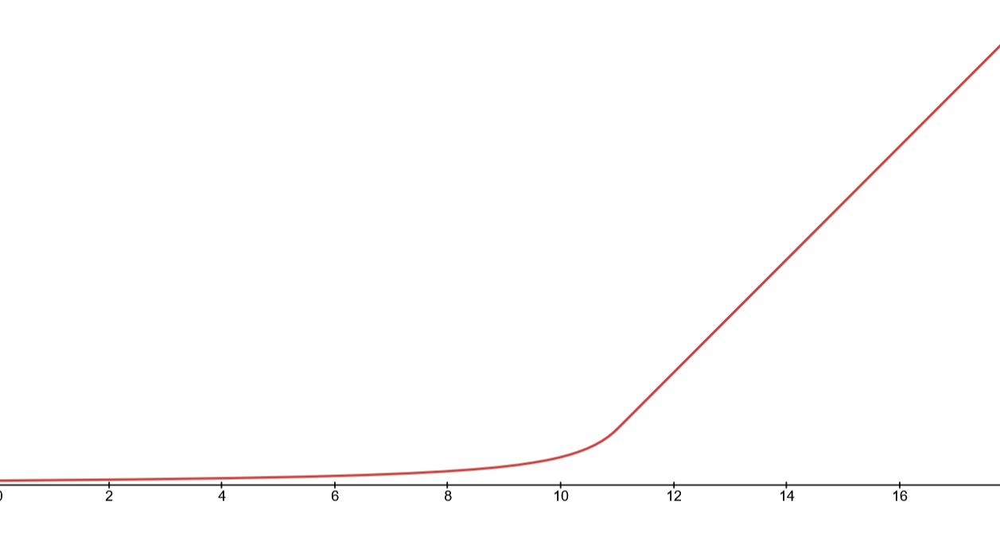

# Fractional Speed



Fractional speed turns pixels/frame into exactly that whilst using unsigned numbers.

```
if tick % frames == 0
    position += pixels
```

> Using 160x160 window with 60hz refresh rate

## 1:10

1 pixel per 10 frames


## 1:1

1 pixel per frame


## 10:1

10 pixels per frame - crosses the window in 15 frames (0.25s)

